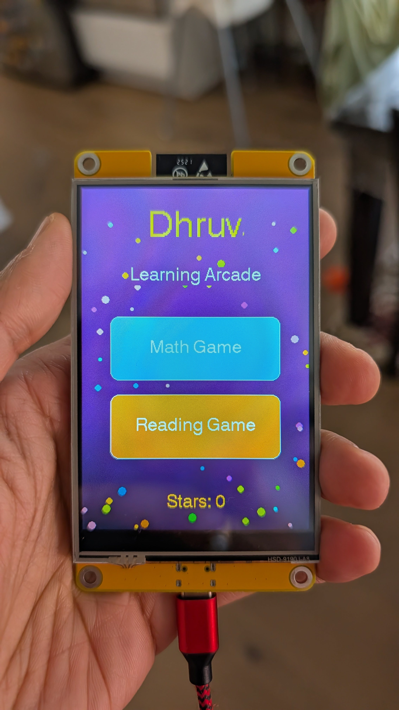
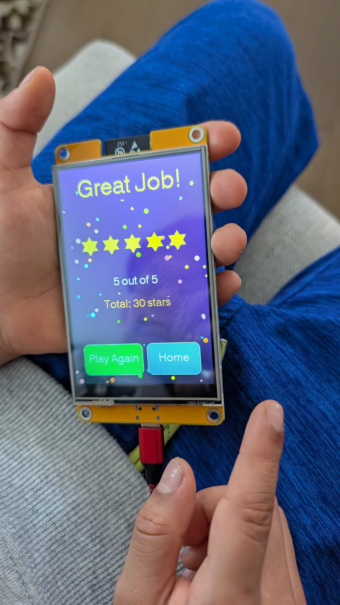

# ESP32 Kid Learning Arcade

A pocket-sized **offline** learning toy for kindergarten and pre-first-grade kids — Math (counting, missing numbers, ten-frame, addition under 10, make-10) and Reading (starts-with letter, missing letter in CVC words, rhyming, upper/lowercase match). Five questions per round, stars as the only reward, no penalties, no timers. **No internet, no accounts, no ads.**

> Built so my 6-year-old has something to play with on long car rides without me handing over a tablet.

<p align="center">
  
  &nbsp;&nbsp;
  
</p>

---

## What you'll need


| Item                               | Approx. price | Notes                                                                                                                                                                            |
| ---------------------------------- | ------------- | -------------------------------------------------------------------------------------------------------------------------------------------------------------------------------- |
| 4.0" ESP32-32E touchscreen display | ~$25          | On Amazon, search **"Hosyond ESP32 4 inch display"** or **"LCDWiki ESP32-32E"**. Make sure the listing says **320×480 ST7796S** with **USB-C and CH340C**.                       |
| USB-C **data** cable               | $0–$10        | Many USB-C cables are charge-only and won't enumerate as a serial device. If your laptop doesn't see the board after plugging it in, swap cables before debugging anything else. |
| Computer (macOS / Windows / Linux) | —             | Only needed once for flashing. After that the device runs standalone on USB power (any phone charger works).                                                                     |


**Total cost to build one: ~$25.**

No soldering, no breadboard, no extra components. The board ships with the display already attached.

---

## One-time computer setup

You need [PlatformIO](https://platformio.org/) — a build system for embedded projects.

### macOS

```bash
brew install platformio
```

If your computer doesn't see the board on `/dev/cu.usbserial-*` or `/dev/cu.wchusbserial-*` after plugging it in, install the [WCH CH340 driver](https://www.wch-ic.com/downloads/CH34XSER_MAC_ZIP.html) and reboot.

### Windows

Install [PlatformIO Core](https://docs.platformio.org/en/latest/core/installation/) or the [PlatformIO IDE for VS Code](https://platformio.org/install/ide?install=vscode). Windows usually picks up the CH340 driver automatically; if it doesn't, grab it from [WCH](https://www.wch-ic.com/downloads/CH341SER_ZIP.html).

### Linux

```bash
pip install --user platformio
sudo usermod -aG dialout $USER   # then log out and back in
```

---

## Build & flash

```bash
git clone https://github.com/gsandi/esp32-kid-learning-arcade.git
cd esp32-kid-learning-arcade

# Find your board's serial port:
pio device list
# Look for the entry whose Description contains "CH340" or "wchusbserial".
# On macOS it'll look like /dev/cu.usbserial-110 or /dev/cu.wchusbserial-110.

# Open platformio.ini and update upload_port and monitor_port to match,
# then build & flash:
pio run -t upload
```

That's it — the device boots into the home screen as soon as the upload finishes.

To watch serial logs (useful if something goes wrong):

```bash
pio device monitor
```

---

## Personalize it before you flash

All personalization lives in `src/main.cpp`. Three things you'll almost certainly want to change:


| What                              | Where                                                 | Default                     |
| --------------------------------- | ----------------------------------------------------- | --------------------------- |
| **Kid's name** on the home screen | `tft.drawString("Dhruv", ...)` (search for `"Dhruv"`) | `"Dhruv"`                   |
| **Admin PIN** for resetting stars | `const char* const ADMIN_PIN = "...";`                | `"0000"` — **change this!** |
| **Questions per round**           | `constexpr int QUESTIONS_PER_ROUND`                   | `5`                         |


The question banks are also in `src/main.cpp` as plain C arrays. Search for any of:

```
countBank, missingNumBank, addBank, make10Bank, tenFrameBank,
startsWithBank, missingLetterBank, rhymeBank, upperLowerBank
```

Adding a question is one line of code per bank. Reflash with `pio run -t upload` to pick up the changes.

---

## Using the device

- **Idle screensaver** — after 60 seconds with no touch the screen goes dark with a floating colour-particle animation. Tap anywhere to wake; if the lock is enabled (see Admin panel) it goes to a PIN screen instead of home.
- **Tap Math or Reading** on the home screen to start a 5-question round.
- **Tap an answer.** Right answer → "Great job!" + a star is earned. Wrong answer → "Try again!" + retry the same question (no penalty).
- After 5 right answers the round-complete screen shows total stars; tap **Play Again** to start a fresh round in the same game.
- Stars persist across power cycles (stored in ESP32 NVS via the `Preferences` library).

### Admin panel (parent only)

1. From the home screen, **press and hold the bottom-right corner for ~2 seconds.** (The corner is unmarked — kids won't stumble on it.)
2. Enter your admin PIN (default `0000` — change it in `main.cpp` before flashing).
3. The admin screen has four controls:


| Button                   | What it does                                                                                         |
| ------------------------ | ---------------------------------------------------------------------------------------------------- |
| **Reset Stars**          | Zeroes the star count and returns to home                                                            |
| **Lock: ON / OFF**       | When ON, device requires the PIN after screensaver or power-on — good for shared devices             |
| **Math: Easy / Hard**    | Easy = counting, ten-frame, addition; Hard = all five types including missing-number and make-10     |
| **Reading: Easy / Hard** | Easy = starts-with and uppercase/lowercase; Hard = all four types including rhyme and missing-letter |


All settings survive power cycles.

---

## Touch calibration

The four `RAW_X_LEFT / RAW_X_RIGHT / RAW_Y_TOP / RAW_Y_BOTTOM` constants near the top of `main.cpp` are tuned to the panel I built on. XPT2046 resistive touch panels vary slightly between units, so your touch may be off by a handful of pixels. With the 60–80px game buttons it's usually fine without recalibration.

If your buttons feel off (or your taps land in the wrong corner entirely):

1. In `loop()`, temporarily add a serial print of the **raw** touch coordinates (`tft.getTouchRaw(&rx, &ry)` — don't apply the `map()` transform).
2. Open `pio device monitor`, then tap each of the four corners of the screen and write down the raw values.
3. Update the four `RAW_`* constants with your readings (X axis: leftmost-tap → `RAW_X_LEFT`, rightmost-tap → `RAW_X_RIGHT`. Y axis: same).
4. Re-flash with `pio run -t upload`.

If the touch axes are mirrored (tapping left registers right), swap the values inside the `RAW_X_LEFT` / `RAW_X_RIGHT` pair (or the `RAW_Y_*` pair). That's it — no code change needed, just swap the numbers.

---

## Troubleshooting


| Symptom                                   | Likely cause + fix                                                                                                                                                                                                                 |
| ----------------------------------------- | ---------------------------------------------------------------------------------------------------------------------------------------------------------------------------------------------------------------------------------- |
| **PlatformIO can't find the board**       | USB cable is charge-only (try another cable) → CH340 driver not installed (see setup) → wrong `upload_port` in `platformio.ini` (run `pio device list`).                                                                           |
| **Display is white / blank**              | Confirm `-DST7796_DRIVER=1` is in `platformio.ini`, not `ILI9486` or `ILI9488`. Some sellers ship the same physical board with different controllers.                                                                              |
| **Touch is mirrored or upside-down**      | Swap the values inside the `RAW_X_`* or `RAW_Y_*` pair (see Touch calibration above).                                                                                                                                              |
| **Letters render blank but numbers work** | You're using TFT_eSPI Font 6 — it's digits + punctuation only. Use Font 4 with `setTextSize(2)` for big readable text.                                                                                                             |
| **Upload fails with "Connecting…" hang**  | Hold the BOOT button on the back of the board, hit `pio run -t upload`, release BOOT once "Connecting…" prints. (Most CH340C boards auto-reset and don't need this — but if yours has a flaky USB-C jack, the manual dance helps.) |


---

## Adding your own questions (SD card)

No recompile needed. Copy the template files from `sd-card-templates/questions/` onto a FAT32-formatted microSD card and pop it into the slot on the back of the board. On boot, the firmware loads those files and appends the questions to the built-in bank. Remove the card and the hardcoded questions still work as a fallback.

**File → question type mapping:**


| File                                    | Game    | Type                            |
| --------------------------------------- | ------- | ------------------------------- |
| `questions/math_count.json`             | Math    | Count the shapes                |
| `questions/math_missing_num.json`       | Math    | Missing number in sequence      |
| `questions/math_add.json`               | Math    | Addition under 10               |
| `questions/math_make10.json`            | Math    | What makes 10?                  |
| `questions/math_ten_frame.json`         | Math    | Ten frame count                 |
| `questions/reading_starts_with.json`    | Reading | What letter does it start with? |
| `questions/reading_missing_letter.json` | Reading | Fill in the missing letter      |
| `questions/reading_rhyme.json`          | Reading | Which word rhymes?              |
| `questions/reading_upper_lower.json`    | Reading | Match uppercase / lowercase     |


**Format at a glance (copy a line, edit it):**

```json
// math_add.json — "a + b = ?", list 3 wrong answers, firmware picks correct = a+b
{"a": 4, "b": 6, "wrong": [8, 9, 11]}

// reading_starts_with.json — "correct" is the 0-based index of the right answer
{"letter": "W", "options": ["Dog", "Cat", "Worm"], "correct": 2}

// math_count.json — shape names: apple ball star flower moon heart triangle square
{"prompt": "How many stars?", "shape": "star", "count": 5, "wrong": [3, 7, 9]}

// math_missing_num.json — use -1 to mark the blank position in the sequence
{"seq": [2, 4, -1, 8], "options": [5, 6, 9], "correct": 6}
```

Each file is a JSON array `[...]` — just add lines between the `[` and `]`. Max 64 questions per type (32 for ten-frame and missing-number).

---

## Customizing further

- **Add a new question type:** add an entry to the `QType` enum, a new `*Bank` array, a case in `bankSizeFor()`, a draw function, and an answer-check case. Roughly 30 lines per type.
- **Change the colors / theme:** all UI rendering is in `main.cpp`. Search for `TFT_PURPLE`, `TFT_YELLOW`, etc. to retheme.
- **Wi-Fi or audio:** explicitly out of scope for v1 — the goal is offline + silent so the toy doesn't compete with bells and whistles for the kid's attention. PRs welcome if you disagree.

---

## Project layout

```
esp32-kid-learning-arcade/
├── platformio.ini                   # Build config + TFT_eSPI pin flags
├── src/main.cpp                     # All firmware (~1400 lines, single file by design)
├── sd-card-templates/questions/     # JSON templates for adding questions via SD card
├── LICENSE
└── README.md
```

The firmware is intentionally a single file. It's easy to read top-to-bottom — splitting it across modules would make forking and tweaking harder, not easier, for the audience this is built for.

---

## Hardware reference

If you want to dig into pinouts or extend the firmware to use the SD slot, the board's spec page is at [lcdwiki.com/4.0inch_ESP32-32E_Display](http://www.lcdwiki.com/4.0inch_ESP32-32E_Display). Key facts:

- ESP32-WROOM-32E, 4 MB flash, 520 KB SRAM
- Display + touch share SPI on GPIO 12/13/14
- SD card is on a **separate** SPI bus (HSPI on 18/19/23) — don't try to share with the display
- Touch IRQ is on GPIO 36 (input-only, no internal pullup)

---

## License

[MIT](LICENSE) — free to use, modify, and **sell**. Build something for your kid, build a few extras for friends. If you make something cool, I'd love to see it.

---

## Credits

- Display driver: [TFT_eSPI](https://github.com/Bodmer/TFT_eSPI) by Bodmer
- Hardware: 4.0" ESP32-32E from [LCDWiki](http://www.lcdwiki.com/4.0inch_ESP32-32E_Display) / Hosyond

