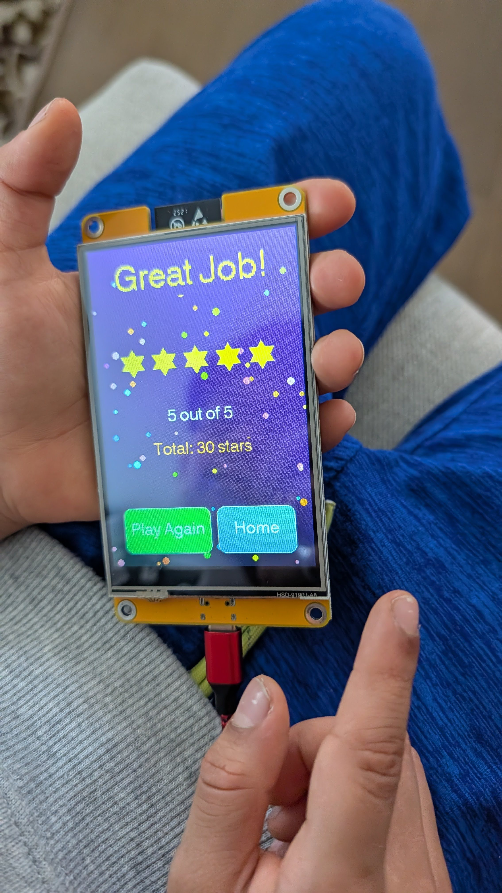

# ESP32 Kid Learning Arcade

A pocket-sized **offline** learning toy for kindergarten and pre-first-grade kids — Math (counting, missing numbers, ten-frame, addition under 10, make-10) and Reading (starts-with letter, missing letter in CVC words, rhyming, upper/lowercase match). Five questions per round, stars as the only reward, no penalties, no timers. **No internet, no accounts, no ads.**

> Built so my 6-year-old has something to play with on long car rides without me handing over a tablet.

<p align="center">
  <a href="https://youtube.com/shorts/shdxOJd6aZ0">
    
  </a>
  &nbsp;&nbsp;
  
</p>
<p align="center"><em>▶ <a href="https://youtube.com/shorts/shdxOJd6aZ0">Watch the demo</a></em></p>

---

> **Two versions exist.** This README walks through the $25 4-inch build, which is
> the one to start with. There is also a 7-inch ESP32-P4 build with capacitive
> touch, sound, Wi-Fi and OTA updates — see [The 7-inch version](#the-7-inch-version-esp32-p4)
> below.

## Who this is for

A parent or hobbyist who wants to build a simple offline learning toy for their kid in an afternoon. **No prior coding or electronics experience required** — if you can copy-paste a few lines into the Terminal app on your Mac, you can build one.

- **Time:** ~30 minutes, most of it automated software installs the first time.
- **Cost:** ~$25 in parts.
- **Soldering:** none. The screen ships pre-attached.

---

## What you'll need

| Item | Approx. price | Notes |
|---|---|---|
| 4.0" ESP32-32E touchscreen display | ~$25 | **US:** [search Amazon for "Hosyond ESP32 4 inch display"](https://www.amazon.com/s?k=hosyond+esp32+4+inch+display) (same hardware is also sold as "LCDWiki ESP32-32E"). The listing must say **320×480 ST7796S** with **USB-C and CH340C**. Manufacturer spec: [lcdwiki.com](http://www.lcdwiki.com/4.0inch_ESP32-32E_Display). |
| USB-C **data** cable | $0–$10 | Many USB-C cables are charge-only and won't enumerate as a serial device. If your laptop doesn't see the board after plugging in, swap cables before debugging anything else. Some boards include one. |
| A computer (Mac, Windows, or Linux) | — | Only needed once for flashing. After that the device runs standalone on USB power (any phone charger works). |

---

## Setup on macOS — the easy path

This is the recommended path if you're on a MacBook.

### Step 1 — Open Terminal

On your Mac, press **⌘ + Space** to open Spotlight, type `Terminal`, and press **Return**. A window with a text prompt will open. Everything below happens here — just paste each command and press Return.

### Step 2 — Download the project

Paste this and press Return:

```bash
cd ~/Desktop && git clone https://github.com/gsandi/esp32-kid-learning-arcade.git && cd esp32-kid-learning-arcade
```

> **First-time only:** macOS may pop up a dialog asking to install "Command Line Tools for Xcode". Click **Install** and wait 5–10 minutes for it to finish, then re-run the line above. This gives you `git` and the basic compilers.

### Step 3 — Run the setup script

```bash
./scripts/setup-macos.sh
```

This installs **Homebrew** (the Mac package manager) and **PlatformIO** (the embedded build system). The first run takes ~5 minutes; macOS may ask for your account password partway through — that's normal.

The script is safe to re-run; anything already installed is skipped.

### Step 4 — Plug in the board and flash

Plug the ESP32 into your Mac with the USB-C cable, then run:

```bash
pio run -t upload
```

PlatformIO auto-detects the board, builds the firmware, and flashes it. The device boots into the home screen the moment the upload finishes (~30 seconds).

### Step 5 — Calibrate the touch screen (required, ~3 minutes)

**Don't skip this step.** Every XPT2046 resistive touch panel reads slightly differently — until you calibrate, your taps will land in the wrong place. The four `RAW_X_LEFT / RAW_X_RIGHT / RAW_Y_TOP / RAW_Y_BOTTOM` constants in `src/main.cpp` are tuned to the panel I built on, not yours.

1. With the device still plugged into your Mac, open the serial monitor:

   ```bash
   pio device monitor
   ```

2. Tap each corner of the screen. Every tap prints a line like:

   ```
   TAP raw=(218,3712) mapped=(...) screen=0 admin=0
   ```

   Write down the `raw=(x,y)` numbers for all four corners — top-left, top-right, bottom-left, bottom-right.

3. Quit the monitor with **Ctrl + C**. Then open `src/main.cpp` in any text editor (TextEdit works — drag the file onto TextEdit's icon, then choose **Format → Make Plain Text** if it complains).

4. Find these four lines near the top of the file and update the numbers with what you wrote down:

   ```cpp
   constexpr uint16_t RAW_X_LEFT   =  223;   // raw X from a leftmost-edge tap
   constexpr uint16_t RAW_X_RIGHT  = 3761;   // raw X from a rightmost-edge tap
   constexpr uint16_t RAW_Y_TOP    =  ...;   // raw Y from a top-edge tap
   constexpr uint16_t RAW_Y_BOTTOM =  ...;   // raw Y from a bottom-edge tap
   ```

5. Save the file, then re-flash:

   ```bash
   pio run -t upload
   ```

6. Tap the home-screen buttons — taps should now land where your finger actually is.

**If your taps register on the wrong side** (tapping left registers as right, or top registers as bottom), the axis is mirrored. Just **swap the two values** within the affected pair (`RAW_X_LEFT` ↔ `RAW_X_RIGHT`, or `RAW_Y_TOP` ↔ `RAW_Y_BOTTOM`) and re-flash. No other code change needed.

### Done

Unplug the device from your Mac and plug it into any phone charger — it now runs standalone.

---

## Setup on Windows or Linux

<details>
<summary>Click to expand</summary>

### Windows

1. Install [PlatformIO IDE for VS Code](https://platformio.org/install/ide?install=vscode).
2. Open the project folder in VS Code.
3. Plug in the board. Windows usually picks up the CH340 driver automatically; if it doesn't, grab it from [WCH](https://www.wch-ic.com/downloads/CH341SER_ZIP.html).
4. Click the PlatformIO **upload** button (right-arrow icon in the bottom toolbar).

### Linux

```bash
pip install --user platformio
sudo usermod -aG dialout $USER   # then log out and back in
git clone https://github.com/gsandi/esp32-kid-learning-arcade.git
cd esp32-kid-learning-arcade
pio run -t upload
```

</details>

---

## Personalize before flashing

All personalization lives in `src/main.cpp`. Three things you'll almost certainly want to change:

| What | Where | Default |
|---|---|---|
| **Kid's name** on the home screen | `tft.drawString("Dhruv", ...)` (search for `"Dhruv"`) | `"Dhruv"` |
| **Admin PIN** for resetting stars | `const char* const ADMIN_PIN = "...";` | `"0000"` — **change this!** |
| **Questions per round** | `constexpr int QUESTIONS_PER_ROUND` | `5` |

The question banks are also in `src/main.cpp` as plain C arrays. Search for any of:

```
countBank, missingNumBank, addBank, make10Bank, tenFrameBank,
startsWithBank, missingLetterBank, rhymeBank, upperLowerBank
```

Adding a question is one line of code per bank. Re-flash with `pio run -t upload` to pick up the changes.

---

## Using the device

- **Idle screensaver** — after 60 seconds with no touch the screen goes dark with a floating colour-particle animation. Tap anywhere to wake; if the lock is enabled (see Admin panel) it goes to a PIN screen instead of home.
- **Tap Math or Reading** on the home screen to start a 5-question round.
- **Tap an answer.** Right answer → "Great job!" + a star is earned. Wrong answer → "Try again!" + retry the same question (no penalty).
- After 5 right answers the round-complete screen shows total stars; tap **Play Again** to start a fresh round in the same game.
- Stars persist across power cycles (stored in ESP32 NVS via the `Preferences` library).

### Admin panel (parent only)

1. From the home screen, **press and hold the bottom-right corner for ~2 seconds.** (The corner is unmarked — kids won't stumble on it.)
2. Enter your admin PIN (default `0000` — change it in `main.cpp` before flashing).
3. The admin screen has four controls:

| Button | What it does |
|---|---|
| **Reset Stars** | Zeroes the star count and returns to home |
| **Lock: ON / OFF** | When ON, device requires the PIN after screensaver or power-on — good for shared devices |
| **Math: Easy / Hard** | Easy = counting, ten-frame, addition; Hard = all five types including missing-number and make-10 |
| **Reading: Easy / Hard** | Easy = starts-with and uppercase/lowercase; Hard = all four types including rhyme and missing-letter |

All settings survive power cycles.

---

## The 7-inch version (ESP32-P4)

Everything above builds the $25 4-inch toy, and that is still the one to build
first. This section covers the bigger sibling: the same game on an Elecrow
CrowPanel Advanced 7" ESP32-P4, with a capacitive screen, sound, Wi-Fi and
over-the-air updates.

It is a harder build. Budget an evening rather than an afternoon, and read the
whole section before you start.

### What's different

| | 4-inch | 7-inch |
|---|---|---|
| Board | Hosyond ESP32-32E, ~$25 | Elecrow CrowPanel Advanced 7" ESP32-P4 HMI, ~$60–70 |
| Display | 320×480 SPI | 1024×600 MIPI DSI, mounted portrait |
| Touch | XPT2046 resistive, **needs calibration** | GT911 capacitive, **no calibration at all** |
| Framework | Arduino-style / PlatformIO | ESP-IDF + LVGL 9 |
| Radio | none | separate ESP32-C6 co-processor over SDIO |
| Extras | — | sound, SD card question bank, OTA updates |

The two things worth knowing up front: **capacitive touch means the calibration
ritual from Step 5 disappears entirely**, and **the P4 has no radio of its own**,
so Wi-Fi runs on a second chip that needs its own firmware. Both are handled
below.

### Step 1 — Get the code

```bash
git clone https://github.com/gsandi/esp32-kid-learning-arcade.git
cd esp32-kid-learning-arcade
git checkout feat/esp32-p4
```

The P4 build lives on that branch, not on `main`. Everything it needs is
committed: the custom board definition (`boards/elecrow_crowpanel_p4_7.json`),
the partition table, and the prebuilt ESP32-C6 firmware under `c6_slave_fw/`.
The display, touch and LVGL components are fetched automatically on first build
by the ESP-IDF component manager, so the first build takes noticeably longer
than later ones.

If you have not built the 4-inch version, run `./scripts/setup-macos.sh` first to
get Homebrew and PlatformIO.

### Step 2 — Find your serial port, and set it

**This is the step people get stuck on.** The board has **two USB-C ports** and
nothing on the silkscreen says which is which. Only one is the UART/flash port.
If the board will not take firmware, try the other port before you debug anything
else.

With the board plugged in, list the ports:

```bash
ls /dev/cu.*
```

`platformio.ini` currently hardcodes `upload_port = /dev/cu.wchusbserial10`,
which is almost certainly not what your Mac calls it. Either edit that line to
match, or pass your port to the flash script in the next step, which overrides
it.

### Step 3 — Flash both chips

```bash
./flash.sh /dev/cu.YOURPORT
```

That one command builds the firmware, flashes the P4, and then writes the
ESP32-C6 network firmware into the `slave_fw` partition at `0x10000`. Run it with
no argument and it falls back to the hardcoded port from `platformio.ini`.

**The first boot looks like a hang, and is not.** The P4 streams the C6 firmware
across SDIO on that first startup, which takes about 30 seconds, and then the
board restarts on its own. Wi-Fi only works from the second boot onward. Let it
finish before concluding anything is broken.

Then unplug it and run it off any USB phone charger, same as the small one.

### Step 4 — There is no step 4

No touch calibration. The panel is capacitive, so it already knows where your
finger is. This is the single biggest quality-of-life difference between the two
builds.

### Optional: questions from an SD card

Drop a `questions.csv` on a FAT-formatted card and the device **appends** those
questions to the built-in ones at boot. It never replaces them, so a missing or
malformed card costs you nothing and the toy always works.

Three line types are recognised, all integers after the prefix:

```
ADD,7,8,15,14,16,0         # 7+8, options 15/14/16, last field = index of the correct one
SKIP,6,6,12,18,24,30,36,0  # skip-count by 6
MULT,7,8,56,48,63,0        # 7x8, options 56/48/63
```

Anything else in the file is ignored. A new topic at school means editing a text
file on a card, with no laptop and no reflash.

### Optional: over-the-air updates

Once the device has Wi-Fi, you rarely need the cable again:

```bash
./ota_push.sh
```

That builds the firmware and serves it over HTTP on port 8080, printing your
machine's IP addresses. On the device, go to **Admin → OTA Update**, enter that
IP, and start it. The device pulls the new firmware into the spare app partition
and reboots into it. A tweak while the kid is mid-round takes about two minutes.

### 7-inch troubleshooting

| Symptom | Fix |
|---|---|
| Board never appears in `ls /dev/cu.*` | You are in the wrong USB-C port of the two. Try the other one, then try a different cable — many USB-C cables are charge-only. |
| `flash.sh` prints `WARNING: c6_slave_fw/network_adapter.bin not found` | You are on `main`, not `feat/esp32-p4`. Check out the branch. |
| Build fails resolving a component | Delete `managed_components/` and `dependencies.lock`, then rebuild so the component manager re-resolves from scratch. |
| First boot seems frozen for ~30s | Expected. The P4 is flashing the C6 over SDIO. It restarts itself when done. |
| Wi-Fi finds no networks on first boot | Also expected. Power-cycle once; the radio comes up from the second boot. |
| SD card only fails when Wi-Fi is on | Known conflict: the C6 link and the SD card share one SDMMC host. The fix is already in `src/main.cpp`; if you have modified the init order, put it back. |

## Troubleshooting

| Symptom | Likely cause + fix |
|---|---|
| **macOS asks for your password during setup** | That's the Homebrew installer. Type your Mac account password and press Return — it's not sent anywhere. |
| **`zsh: command not found: pio`** after the setup script | Quit Terminal and open a fresh window. PATH changes only apply to new shells. |
| **PlatformIO can't find the board** | (1) USB-C cable is charge-only — try a different cable. (2) CH340 driver missing — install [WCH CH340](https://www.wch-ic.com/downloads/CH34XSER_MAC_ZIP.html) and reboot. (3) Multiple USB serial devices plugged in — set `upload_port` explicitly in `platformio.ini`. |
| **Display is white / blank** | Confirm `-DST7796_DRIVER=1` is in `platformio.ini`, not `ILI9486` or `ILI9488`. Some sellers ship the same physical board with different controllers. |
| **Touch is mirrored or upside-down** | Swap the values inside the `RAW_X_*` or `RAW_Y_*` pair in `main.cpp` (see Step 5 — Calibrate the touch screen). |
| **Letters render blank but numbers work** | You're using TFT_eSPI Font 6 — it's digits + punctuation only. Use Font 4 with `setTextSize(2)` for big readable text. |
| **Upload fails with "Connecting…" hang** | Hold the BOOT button on the back of the board, hit `pio run -t upload`, release BOOT once "Connecting…" prints. (Most CH340C boards auto-reset and don't need this — but if yours has a flaky USB-C jack, the manual dance helps.) |

---

## Customizing further

- **Add a new question type:** add an entry to the `QType` enum, a new `*Bank` array, a case in `bankSizeFor()`, a draw function, and an answer-check case. Roughly 30 lines per type.
- **Change the colors / theme:** all UI rendering is in `main.cpp`. Search for `TFT_PURPLE`, `TFT_YELLOW`, etc. to retheme.
- **Wi-Fi or audio:** explicitly out of scope for v1 — the goal is offline + silent so the toy doesn't compete with bells and whistles for the kid's attention. PRs welcome if you disagree.

---

## Using a different display panel

The layout scales proportionally with the panel. Change two pairs of values and the whole UI follows:

```cpp
// src/main.cpp, near the top
constexpr int16_t SCREEN_W = 320;   // ← your panel's width
constexpr int16_t SCREEN_H = 480;   // ← your panel's height
```

```ini
; platformio.ini build_flags
-DTFT_WIDTH=320
-DTFT_HEIGHT=480
```

All hardcoded coordinates pass through `scaleW()` / `scaleH()` / `scaleMin()` constexpr helpers, so the 320×480 build is byte-identical to the reference and other sizes proportionally rescale at compile time (zero runtime overhead).

### Font caveat

TFT_eSPI built-in fonts (Font 2 / Font 4 / Font 6 / Font 8) are bitmap fonts at **fixed pixel sizes** — they don't scale automatically with the geometry. On panels far from 320×480 you'll want to revisit the `setTextFont(N)` and `setTextSize(N)` calls. As a starting point:

| Panel | Aspect | Body text<br>(Font 2) | Titles + button labels<br>(currently Font 4) | Big inline numbers<br>(currently Font 6) | Big single letter<br>(currently Font 4 + size 4) | Notes |
|---|---|---|---|---|---|---|
| **240×320** | 3:4 | Font 2 | Font 2 (drop sizes) | Font 4 + size 2 | Font 6 plain | Tight; consider shorter button labels |
| **320×480** ✅ | 2:3 | Font 2 | Font 4 | Font 6 | Font 4 + size 4 | Reference. No changes. |
| **480×800** | 3:5 | Font 4 | Font 4 + size 2 | Font 8 (digits only) | Font 4 + size 5–6 | Lots of room — bump everything up a notch |
| **320×240 / 480×320 (landscape)** | 4:3 / 3:2 | — | — | — | — | Real layout rework, not just fonts: vertically-stacked buttons need to become side-by-side, header/footer move, the ten-frame grid wants to be wider-not-taller. Better treated as a port than a tweak. |

Heights for reference: Font 2 ≈ 16px, Font 4 ≈ 26px, Font 6 ≈ 48px (digits only), Font 8 ≈ 75px (digits only). `setTextSize(N)` multiplies the bitmap by integer `N` (looks chunky for `N` > 2).

If you ship a working build for a different panel, please open a PR — the panel matrix is more useful filled in by people who actually built one.

---

## Project layout

```
esp32-kid-learning-arcade/
├── platformio.ini                   # Build config + TFT_eSPI pin flags
├── scripts/setup-macos.sh           # One-shot macOS setup (Homebrew + PlatformIO)
├── src/main.cpp                     # All firmware (~1400 lines, single file by design)
├── assets/                          # Photos used in this README
├── LICENSE
└── README.md
```

The firmware is intentionally a single file. It's easy to read top-to-bottom — splitting it across modules would make forking and tweaking harder, not easier, for the audience this is built for.

---

## Hardware reference

If you want to dig into pinouts or extend the firmware, the board's spec page is at [lcdwiki.com/4.0inch_ESP32-32E_Display](http://www.lcdwiki.com/4.0inch_ESP32-32E_Display). Key facts:

- ESP32-WROOM-32E, 4 MB flash, 520 KB SRAM
- Display + touch share SPI on GPIO 12/13/14
- Touch IRQ is on GPIO 36 (input-only, no internal pullup)

---

## License

[MIT](LICENSE) — free to use, modify, and **sell**. Build something for your kid, build a few extras for friends. If you make something cool, I'd love to see it.

---

## Credits

- Display driver: [TFT_eSPI](https://github.com/Bodmer/TFT_eSPI) by Bodmer
- Hardware: 4.0" ESP32-32E from [LCDWiki](http://www.lcdwiki.com/4.0inch_ESP32-32E_Display) / Hosyond
- Built with development assistance from [Claude Code](https://claude.com/claude-code)
